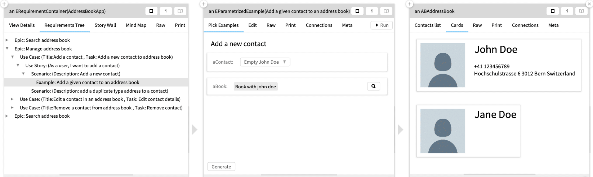

## Moldable Requirements

Requirements engineering is a sequential as well as a cyclic process. Several stakeholders motivated to make a project successful are ready to go on a battlefield with their favorite tools in their arsenal. Sadly, enabling coordination or collaboration between these highly motivated stakeholders also means making their tools interact with each other.

I argue that the requirements must be specified, managed, and implemented in a single environment. 
Such an approach will be useful only when representations of requirements are adapted (i.e., molded) to suit the needs of various technical and non-technical stakeholders. 
Provided right interfaces, an IDE can be an excellent venue for such a confluence of static requirements and live domain objects. 

