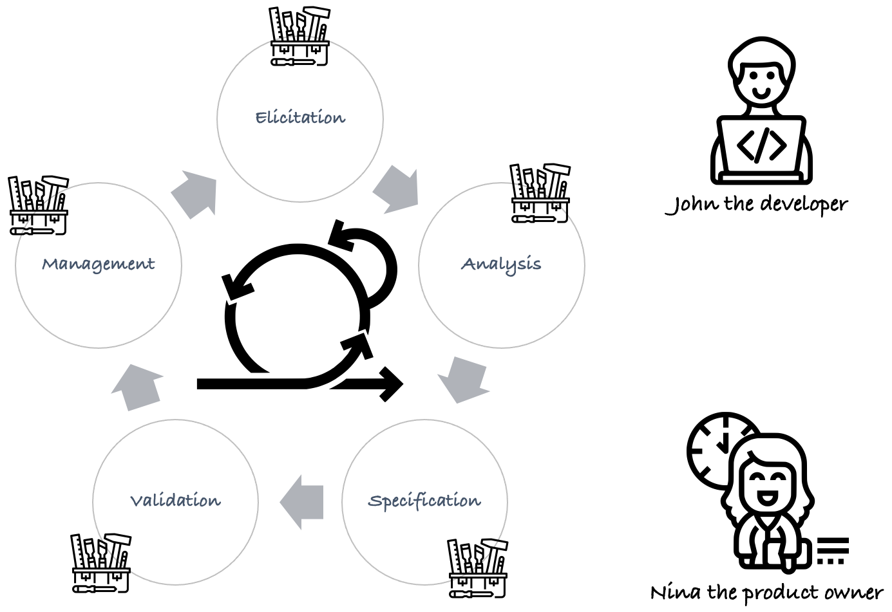

## Moldable Requirements

Requirements engineering is a sequential as well as a cyclic process. Several stakeholders motivated to make a project successful are ready to go on a battlefield with their favorite tools in their arsenal. Sadly, enabling collaboration or coordination between these highly motivated stakeholders also means making their tools interact with each other.

